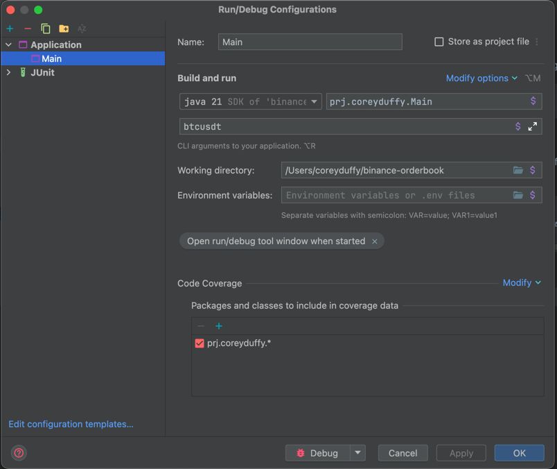
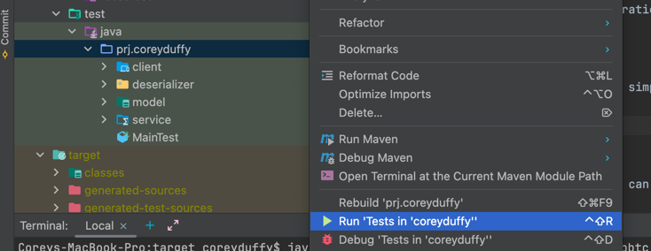

# Binance Orderbook

This console application retrieves and displays the most recent Order Book for a specified market symbol (e.g., BTCUSDT) from the Binance Exchange in real-time. 

Utilising both the Binance REST API and WebSocket API, the application fetches an initial Order Book snapshot and subsequently listens for and processes live updates. 

The first 3 orders for both buy (bids) and sell (asks) sides/orders are displayed in JSON format on STDOUT, updating with each new event received. 

The application sorts bids in descending order and asks in ascending order by price, presenting them in a clear and continuously updated manner.

## How To Run The Application

### Via Maven
#### Compiling the application
You can compile the application by running:
```
mvn clean package
```

### Running the application
#### Packaged from Maven
If you've followed the steps above to compile the application via maven, you can navigate to the target folder and run the application via: 
```
cd target
java -jar binance-orderbook-1.0-SNAPSHOT.jar <YOUR SYMBOL HERE>
```

#### Via IntelliJ
Create a new configuration for the Main class like so:


## How To Run Tests
You can run tests by simply executing the command below, from the root of this project:
```
mvn test
```

or from IntelliJ you can right-click the `src/test/java/prj/coreyduffy` folder and click 'Run Tests in coreyduffy'



## Design decisions
### Code structure
I've structured the codebase by areas of functionality e.g. client, model, service, etc. 

I've chosen this modular approach as I feel it aids in understanding the system's architecture at a glance and allows for easier navigation.

For a larger project e.g. if the project contained code to query multiple different crypto exchanges, then it may be more beneficial to structure the project by "domain" 
e.g. a binance directory, potentially with nested client, model, service directories within it and a coinbase directory with its own nested directories, etc.

### Decoupling components
Where possible, I've also aimed to reduce coupling between different classes through dependency injection.
This allows for easier unit testing and makes it easier to swap out potentially different implementations in the future.
With more time, I feel this could be further improved.

### Testing
I've included a suite of unit tests in the `/binance-orderbook/src/test` directory. 
I've implemented Test-Driven-Development where possible to ensure that I maintained a working solution as I added new features/functionality.

### Connecting to the WebSocket before getting the depth snapshot
I made sure to connect to the Depth Events stream before getting the initial depth snapshot to ensure that I didn't miss any events between getting the snapshot and connecting to the stream.

### Buffering events
All depth events are buffered/sent to a concurrentQueue. This ensures that no events are lost while the depth snapshot is retrieved.
Once I obtain the depth snapshot I then poll from this buffer/queue to find all events that occurred after the depth snapshot was taken.
Any events before the depth snapshot are not applied to the OrderBook.

### Error Handling
I've included some validation of user input to ensure that they only pass one argument to the application. 
I've also ensured that any errors that occur within the application are wrapped in contextual exceptions.

Currently, errors that occur from reading the Depth stream are wrapped in an appropriate exception and thrown. 
With more time, a useful improvement would be to wait with an exponential backoff for any sort of connection error, attempt to re-connect, re-generate the depth snapshot, and update the order book again. 
This would help ensure that updates aren't lost to the order book and an accurate local order book is still output to the user.

### Libraries
I've tried to keep the use of libraries to a minimum. 

The libraries I have used are:
- Jackson, for deserialising json responses from the http and websocket endpoints.
- Testing libraries (e.g. Junit and Mockito) for writing comprehensive unit tests.
